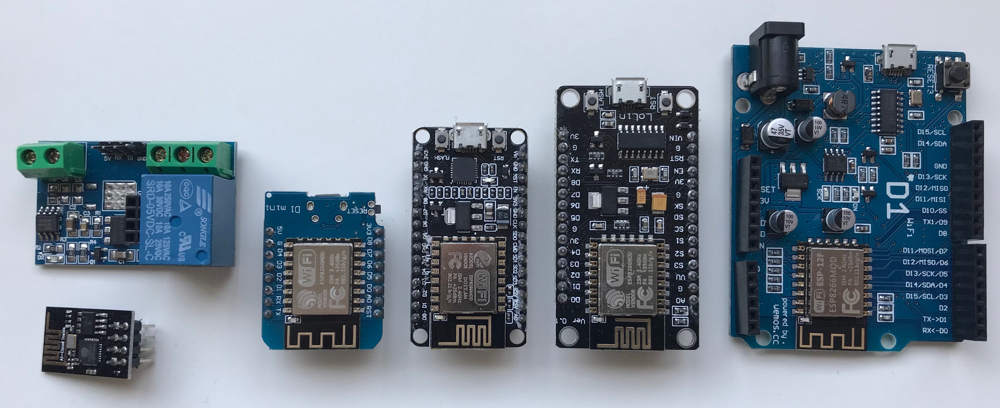
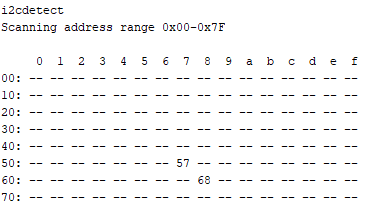
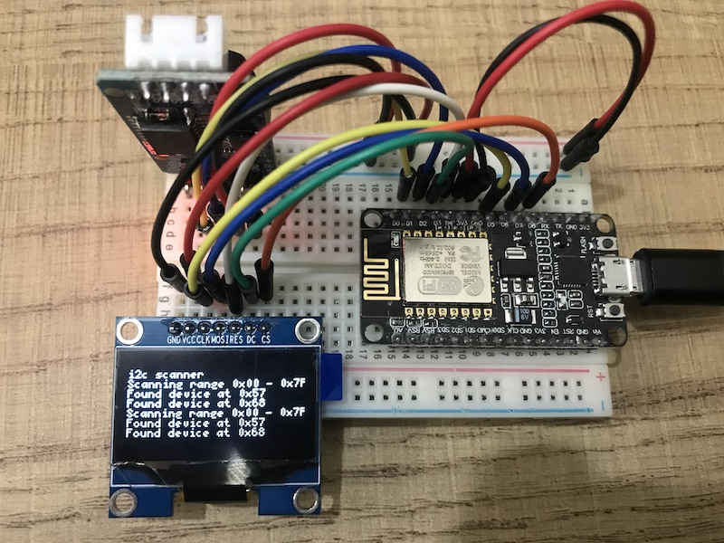
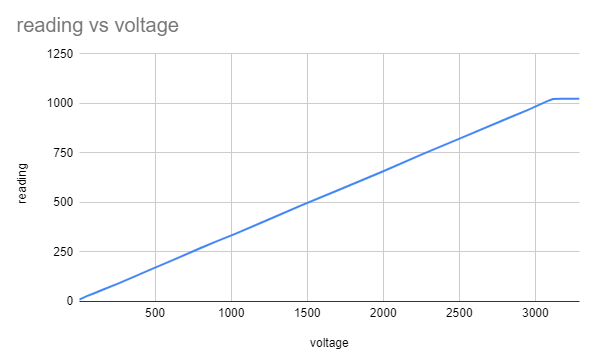

# Projects with the ESP8266

You can get a variety of different ESP8266 boards here in HCM, for less than $3. One resource is  [CỬA HÀNG IC ĐÂY RỒI](https://icdayroi.com/). Another one is [Công Ty thegioiic](https://www.thegioiic.com/). Here are some boards I got and used in 2018:



## [Arduino C projects](arduino_c)

### OLED Display driver sh1106 and ssd1306

### [I2C scanner](arduino_c/SH1106_SPI_I2C_scanner)

Using SCL (D1 or GPIO5) and SDA (D2 or GPIO4) we get the hardware I2C of the ESP8266 and can scan for connected devices like RTC, 1Kbyte EEPROM, BME280 or 1602 displays. The 256bit ID is displayed on the 128x64 SH1106 SPI 1.13" OLED display and the serial bus:




### [Analog pin reader](arduino_c/read_analog)

From zero to 3.1 Volt its a linear reading:



### [Blink 2020](arduino_c/Blink2020)

Different blink sequence and placeholder for various LED pins and HIGH/LOW combination:

```c
/* Blink */
// T-Koala:    5
// Wemos lite: 4
// LORA915:    2   and ESP8266 NodeMCU, D1 R32 (Arduino size)
// T8 V1.7:    21
// T-Dislay:   
// ATMega2560: 13  and Arduino Uno, Leonardo


// int ledPin = LED_BUILTIN;
int ledPin = 2;
//bool light = HIGH; // LORA915, T-Koala, T8, Arduino
//bool dark  = LOW;
bool light = LOW; // WEMOS Lite, ESP8266 NODEMCU
bool dark  = HIGH;
```

## [ESP IDF](RTOS_SDK) 

Directly program to the board on the terminal with `~/ make flash monitor`. For example [CoreMark](../benchmark/CoreMark).

## IoTman

In the window of our makerspace ... follows, with servo and LED, can be remotely controlled. Database on own webseite https://mypdesign.org or https://stemfair.org. Mal sehen. Das war ein Plan in 2018 - never happened, like the Makerspace.
