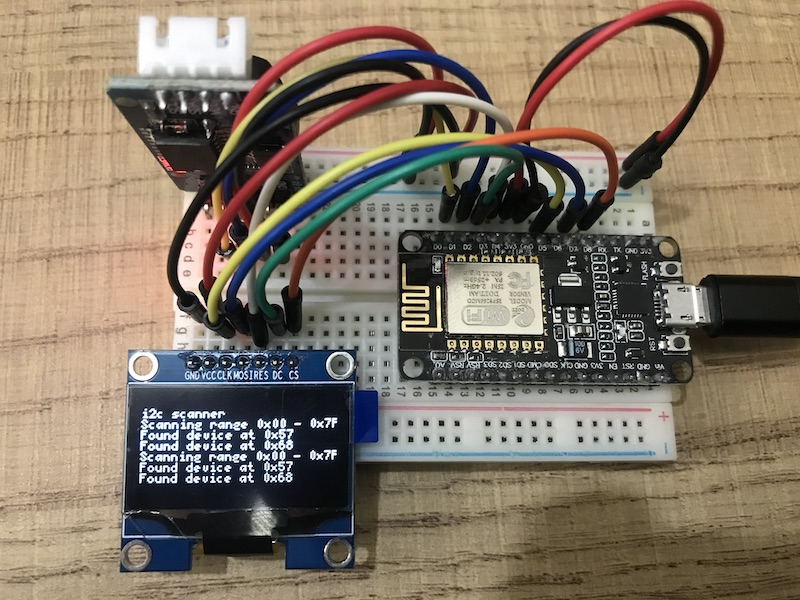
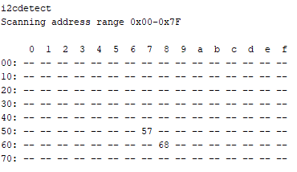

# I2C scanner with SH1106 OLED display output

That's how the setup looks like:



And that's the serial output:



Finally the code:

``` c
// I2C scanner on ESP8266 with 128x64 OLED SPI display 
// Buffer 26x9 with 5x7 font
// 2020/07/14 v0.3
//
// D1 SCL               GPIO5
// D2 SDA               GPIO4
// D3 DC   data/clock   GPIO0   x
// D4 RST  reset        GPIO2   x
// D5 CLK  clock        GPIO14  x
// D6 MISO              GPIO12
// D7 MOSI              GPIO13  x
// D8 CS   Chip Select  GPIO15  x

#include <Arduino.h>
#include <U8x8lib.h>
#include <U8g2lib.h>
#include <SPI.h>
#include <Wire.h>
#include <DS3231.h>

U8G2_SH1106_128X64_NONAME_1_4W_HW_SPI u8g2(U8G2_R0, /* cs=*/ D8, /* dc=*/ D3, /* reset=*/ D4);

#define U8LOG_WIDTH 26
#define U8LOG_HEIGHT 9
uint8_t u8log_buffer[U8LOG_WIDTH*U8LOG_HEIGHT];
U8G2LOG u8g2log;

void setup(void) {
  Wire.begin();
  Serial.begin(115200);
  Serial.println("\ni2cdetect");

  u8g2.begin();
  u8g2.setFont(u8g2_font_5x7_mf);
  
  u8g2log.begin(u8g2, U8LOG_WIDTH, U8LOG_HEIGHT, u8log_buffer);
  u8g2log.setRedrawMode(0);    // 0: Update screen with newline, 1: Update screen for every char
  u8g2log.print("\ni2c scanner\n");
}

void loop(void) {
  byte error, address, address_l, address_h;
  int nDevices;
  Serial.println("Scanning address range 0x00-0x7F");
  Serial.println(" ");
  Serial.println("     0  1  2  3  4  5  6  7  8  9  a  b  c  d  e  f");
  u8g2log.print("Scanning range 0x00 - 0x7F\n");
  nDevices = 0;
  for(address_h = 0; address_h <= 7; address_h++ ) {
    Serial.print(address_h);
    Serial.print("0: ");
    for(address_l = 0; address_l < 16; address_l++) {
      address = address_h * 16 +  address_l;
      Wire.beginTransmission(address);
      error = Wire.endTransmission();
      if (error == 0) {
        Serial.print(address_h);
        Serial.print(address_l,HEX);
        Serial.print(" ");
        u8g2log.print("Found device at 0x");
        u8g2log.print(address,HEX);
        u8g2log.print("\n");
        nDevices++;
      }
      else if (error==4) {
        Serial.print("xx ");
      } else {
        Serial.print("-- ");   
      }
    }
    Serial.println(" ");
  }
  if (nDevices == 0) {
    Serial.println("No I2C devices found.\n");
    u8g2log.print("No I2C devices found.\n");
  }
  Serial.println(" ");
  delay(10000);  
}
```
