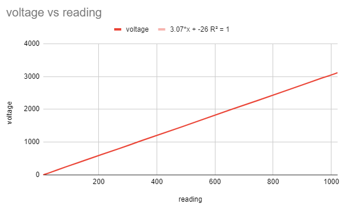
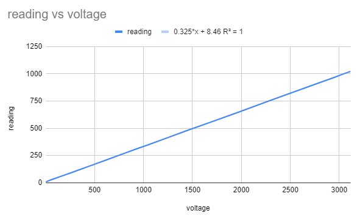

# read_analog

The analog input pin of the ESP8266 is pretty linear and has no offset like the ESP32. It's great for temperature measurement.

Some measurements have been done for the linearity and stored in [esp8266_analog_input.xlsx](esp8266_analog_input.xlsx)

Here the graph:

